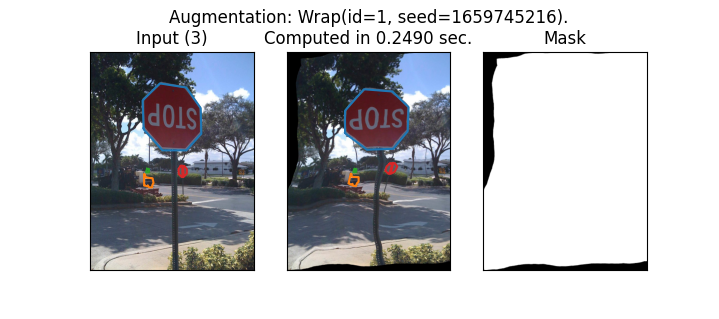
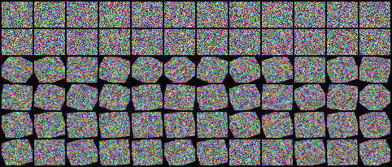
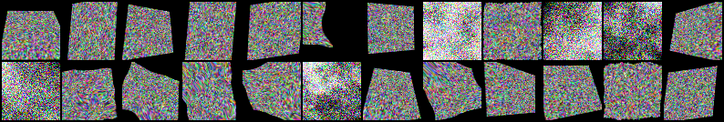
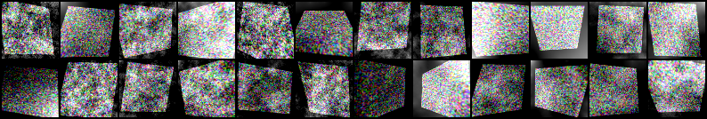
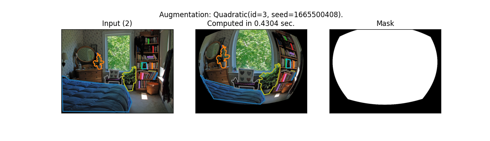

# Tormentor : pyTORch augMENTOR

Image data augmentation for pytorch

### Instalation:

Instaling current version with pip:
```bash
pip3 install --user --upgrade git+https://github.com/anguelos/tormentor
```

### Use Cases:
* Augment sample:
```python
import torch, tormentor
img = torch.rand(3, 119,137) 
mask = torch.ones([1, 119,137])
pc = (torch.rand(9),torch.rand(9))
aug = tormentor.Perspective()

aug(pc, img) # augment pointcloud and respective image
aug(pc, img, compute_img=False) # augment only pointcloud, img passed for dimensions
aug(pc, torch.empty([1, 320, 240]), compute_img=False) # augment only pointcloud, tensor passed for dimensions
aug(mask, is_mask=True) # augment mask
```

* Augment batch:
```python
import torch, tormentor
img = torch.rand(7,3, 119,137) 
mask = torch.ones([7,1, 119,137])
pcl = [(torch.rand(9), torch.rand(9)) for _ in range(7)] 
aug = tormentor.Rotate()

aug(pcl, img) # augment pointcloud and respective image
aug(pcl, img, compute_img=False) # augment only pointcloud, img passed for dimensions
aug(pcl, torch.empty([7, 1, 320, 240]), compute_img=False) # augment only pointcloud, tensor passed for dimensions
aug(mask, is_mask=True) # augment mask
```

* Augment MSCoco compliant Dataset:
```python
import torchvision, tormentor
ds = torchvision.datasets.CocoDetection(root="./tmp_data/coco/val2017",
                                        annFile="./tmp_data/coco/annotations/instances_val2017.json",
                                        transform=torchvision.transforms.ToTensor());
aug_ds = tormentor.AugmentedCocoDs(ds, tormentor.Wrap(), device="cpu", add_mask=True)
inputs, target, validity = aug_ds[3] # accesing a single sample
aug_ds.show_augmentation(3)
```


If the device is a GTX 980 Ti time is 0.1 sec. for larger images, the ratio grows up to x10. 

* Change Augmentation Distributions:
```python
import math, tormentor, torch, torchvision
tile = lambda x: torchvision.transforms.ToPILImage()(torchvision.utils.make_grid(x.cpu(), nrow=12))
generic_aug = tormentor.Rotate()
RotateABit = tormentor.Rotate.override_distributions(radians = tormentor.Uniform((0., math.pi / 8))) 
custom_aug = RotateABit()
batch = torch.rand(24, 3, 32, 38, device="cuda")
tile(torch.cat([batch, generic_aug(batch), custom_aug(batch)], dim=0)).show()
```


* Random Augmentation Type:
```python
import math, tormentor, torch, torchvision
tile = lambda x: torchvision.transforms.ToPILImage()(torchvision.utils.make_grid(x.cpu(), nrow=12))
augmentation_types = [tormentor.Perspective, tormentor.Wrap, tormentor.PlasmaBrightness]
CustomAugmentation = tormentor.AugmentationChoice.create(augmentation_types)
aug = CustomAugmentation() 
batch = torch.rand(24, 3, 64, 64, device="cuda")
tile(aug(batch)).show()
# checkup on determinism:
tile(aug(batch)).show()
```


* Augmentation Cascade:
```python
import math, tormentor, torch, torchvision
tile = lambda x: torchvision.transforms.ToPILImage()(torchvision.utils.make_grid(x.cpu(), nrow=12))
augmentation_types = [tormentor.Perspective, tormentor.PlasmaBrightness]
CustomAugmentation = tormentor.AugmentationCascade.create(augmentation_types)
aug = CustomAugmentation() 
batch = torch.rand(24, 3, 64, 64, device="cuda")
tile(aug(batch)).show()
```



* Create Our Augmentation
```python
import tormentor

class Lense(tormentor.SpatialImageAugmentation):
    center_x = tormentor.Uniform((-.3, .3))
    center_y = tormentor.Uniform((-.3, .3))
    gamma = tormentor.Uniform((1., 1.))

    def generate_batch_state(self, sampling_tensors):
        batch_sz = sampling_tensors[0].size(0)
        gamma = type(self).gamma(batch_sz, device=sampling_tensors[0].device).view(-1)
        center_x = type(self).center_x(batch_sz, device=sampling_tensors[0].device).view(-1)
        center_y = type(self).center_y(batch_sz, device=sampling_tensors[0].device).view(-1)
        return center_x, center_y, gamma

    @classmethod
    def functional_sampling_field(cls, sampling_field, center_x, center_y, gamma):
        field_x, field_y = sampling_field
        center_x = center_x.unsqueeze(dim=1).unsqueeze(dim=1)
        center_y = center_y.unsqueeze(dim=1).unsqueeze(dim=1)
        gamma = gamma.unsqueeze(dim=1).unsqueeze(dim=1)
        distance = ((center_x - field_x)**2 + (center_y - field_y)**2) ** .5
        #distance = 1/(1+distance)
        field_x, field_y = (field_x + field_x * distance ** gamma) , (field_y + field_y * distance ** gamma) 
        return field_x, field_y
```


### Design Principles

* Simplify the definition of augmentations
* Every instance of every augmentation class is deterministic.
* Inputs and Outputs are pytorch tensors and pytorch is prefered for all computation.
* All data are by default 4D: [batch x channel x width x height].
* Single sample augmentation: batch-size must always be 1.
* Threadsafety: Every augmentation instance must be threadsafe.
* Input/Output is restricted to one or more channels of 2D images.
* Augmentations either preserve channels or the preserve pixels (space).
* The augmentation class has also its factory as a classmethod
* Restrict dependencies on torch and kornia (at least for the core packages).

### Factory Dictates Constructor

In order to minimize the code needed to define an augmentation.
The factory defines the random distributions from wich augmentation sample.
The inherited constructor handles random seeds.
The method forward_sample_img samples from the random distributions aug_parameters and employs them.


### Internal Conventions

* Pointclouds are represented in image coordinates Sampling fields in normalised -1,1 coordinates
* By default we write code for batch processing
* Determinism is strictly handled by BaseAugmentation and all augment_*** methods.
* An augmentation must reside in a single device
* All randomness must be coming from pytorch
* Spatial augmentation samplingfields are normalised to -1, 1 so their effect magnitude is proporsional to image size (They are top down).